# LinkedIn System - Class Diagram

## Overview

The LinkedIn System is organized using a modular architecture pattern:

- **Enums** (`src/enums/`): All enumeration types (AccountType, ConnectionStatus, PostType, etc.)
- **Models** (`src/models/`): Entity classes - User, Connection, Post, Message, JobPosting, etc.
- **Repositories** (`src/repositories/`): Data access layer - UserRepository, ConnectionRepository, etc.
- **Services** (`src/services/`): Business logic - UserService, ConnectionService, PostService, etc.
- **Utils** (`src/utils/`): Shared utilities - Validators, custom Errors, IRepository interface

Each class resides in its own file for maintainability, making it easy to locate, test, and update individual components.

## Mermaid Class Diagram

```mermaid
classDiagram
    class User {
        -userId: UUID
        -email: String
        -firstName: String
        -lastName: String
        -headline: String
        -summary: String
        -profilePicture: String
        -location: String
        -industry: String
        -accountType: AccountType
        -isVerified: Boolean
        -createdAt: DateTime
        +getFullName(): String
        +updateProfile(data): Boolean
        +verifyEmail(): void
        +getExperiences(): Experience[]
        +getEducations(): Education[]
        +getSkills(): Skill[]
        +getConnections(): Connection[]
        +getPosts(): Post[]
    }

    class AccountType {
        <<enumeration>>
        STANDARD
        RECRUITER
        ADMIN
    }

    class Experience {
        -experienceId: UUID
        -userId: UUID
        -jobTitle: String
        -company: String
        -location: String
        -startDate: Date
        -endDate: Date
        -description: String
        -isCurrent: Boolean
        +updateTitle(title): void
        +markAsCurrent(): void
        +markAsEnded(endDate): void
    }

    class Education {
        -educationId: UUID
        -userId: UUID
        -school: String
        -degree: String
        -fieldOfStudy: String
        -startYear: Int
        -endYear: Int
        -grade: String
        +getYearsAttended(): Int
    }

    class Skill {
        -skillId: UUID
        -userId: UUID
        -skillName: String
        -proficiency: ProficiencyLevel
        -endorsementCount: Int
        +addEndorsement(): void
        +updateProficiency(level): void
        +getEndorsemenCount(): Int
    }

    class ProficiencyLevel {
        <<enumeration>>
        BEGINNER
        INTERMEDIATE
        ADVANCED
        EXPERT
    }

    class Certification {
        -certificationId: UUID
        -userId: UUID
        -certificationName: String
        -issuingOrganization: String
        -issueDate: Date
        -expiryDate: Date
        -credentialUrl: String
        +isExpired(): Boolean
    }

    class Connection {
        -connectionId: UUID
        -userId: UUID
        -connectedUserId: UUID
        -status: ConnectionStatus
        -connectionLevel: ConnectionLevel
        -connectedAt: DateTime
        +sendRequest(): void
        +acceptRequest(): void
        +rejectRequest(): void
        +getConnectionLevel(): ConnectionLevel
    }

    class ConnectionStatus {
        <<enumeration>>
        PENDING
        ACCEPTED
        REJECTED
        BLOCKED
    }

    class ConnectionLevel {
        <<enumeration>>
        FIRST_DEGREE
        SECOND_DEGREE
        THIRD_DEGREE_PLUS
    }

    class Post {
        -postId: UUID
        -userId: UUID
        -content: String
        -postType: PostType
        -mediaUrl: String
        -likeCount: Int
        -commentCount: Int
        -shareCount: Int
        -visibility: PostVisibility
        -isActive: Boolean
        -createdAt: DateTime
        +like(): void
        +unlike(): void
        +addComment(comment): PostComment
        +deletePost(): void
        +getComments(): PostComment[]
    }

    class PostType {
        <<enumeration>>
        ARTICLE
        JOB_OPENING
        ACHIEVEMENT
        RESEARCH
        FINDING
        UPDATE
    }

    class PostVisibility {
        <<enumeration>>
        PUBLIC
        CONNECTIONS_ONLY
        PRIVATE
    }

    class PostComment {
        -commentId: UUID
        -postId: UUID
        -userId: UUID
        -content: String
        -likeCount: Int
        -createdAt: DateTime
        +updateContent(content): void
        +deleteComment(): void
        +like(): void
    }

    class PostLike {
        -likeId: UUID
        -userId: UUID
        -postId: UUID
        -commentId: UUID
        -likeType: LikeType
        -createdAt: DateTime
    }

    class LikeType {
        <<enumeration>>
        POST
        COMMENT
    }

    class Message {
        -messageId: UUID
        -senderId: UUID
        -receiverId: UUID
        -content: String
        -mediaUrl: String
        -isRead: Boolean
        -readAt: DateTime
        -createdAt: DateTime
        +markAsRead(): void
        +getFormattedContent(): String
    }

    class JobPosting {
        -jobPostingId: UUID
        -recruiterId: UUID
        -companyId: UUID
        -jobTitle: String
        -description: String
        -requirements: String
        -location: String
        -jobType: JobType
        -salaryMin: Decimal
        -salaryMax: Decimal
        -applicationCount: Int
        -isActive: Boolean
        +getApplications(): JobApplication[]
        +closePosting(): void
        +incrementApplicationCount(): void
    }

    class JobType {
        <<enumeration>>
        FULL_TIME
        PART_TIME
        CONTRACT
        INTERN
    }

    class JobApplication {
        -applicationId: UUID
        -jobPostingId: UUID
        -userId: UUID
        -resumeUrl: String
        -coverLetter: String
        -status: ApplicationStatus
        -ratings: Int
        -feedback: String
        -appliedAt: DateTime
        +updateStatus(status): void
        +addRating(rating, feedback): void
        +canWithdraw(): Boolean
    }

    class ApplicationStatus {
        <<enumeration>>
        APPLIED
        REVIEWING
        SHORTLISTED
        REJECTED
        ACCEPTED
    }

    class Company {
        -companyId: UUID
        -companyName: String
        -industry: String
        -website: String
        -location: String
        -description: String
        -logo: String
        -totalEmployees: Int
        -isVerified: Boolean
        +updateInfo(data): void
        +verify(): void
        +getJobPostings(): JobPosting[]
    }

    class Notification {
        -notificationId: UUID
        -userId: UUID
        -notificationType: NotificationType
        -title: String
        -message: String
        -sourceUserId: UUID
        -relatedObjectId: UUID
        -isRead: Boolean
        -createdAt: DateTime
        +markAsRead(): void
        +getFormattedMessage(): String
    }

    class NotificationType {
        <<enumeration>>
        CONNECTION_REQUEST
        MESSAGE
        JOB_ALERT
        COMMENT
        LIKE
        MENTION
    }

    class SearchFilter {
        -filterId: UUID
        -userId: UUID
        -filterType: SearchFilterType
        -filterName: String
        -filterCriteria: Map<String, Object>
        -isSaved: Boolean
        +saveFilter(): void
        +removeFilter(): void
        +applyFilter(): SearchResult[]
    }

    class SearchFilterType {
        <<enumeration>>
        PEOPLE
        COMPANIES
        JOBS
    }

    %% Service classes
    class UserService {
        -userRepository: UserRepository
        -experienceRepository: ExperienceRepository
        -educationRepository: EducationRepository
        +registerUser(data): User
        +updateProfile(userId, data): User
        +getFullProfile(userId): UserProfile
        +verifyUser(userId): void
        +searchUsers(criteria): User[]
    }

    class ConnectionService {
        -connectionRepository: ConnectionRepository
        -userRepository: UserRepository
        +sendConnectionRequest(from, to): Connection
        +acceptConnection(connectionId): Connection
        +rejectConnection(connectionId): void
        +getConnections(userId): Connection[]
        +getConnectionLevel(from, to): ConnectionLevel
        +blockUser(userId, blockedUserId): void
    }

    class PostService {
        -postRepository: PostRepository
        -postCommentRepository: PostCommentRepository
        -postLikeRepository: PostLikeRepository
        +createPost(userId, content, type): Post
        +deletePost(postId): void
        +likePost(postId, userId): void
        +unlikePost(postId, userId): void
        +addComment(postId, userId, content): PostComment
        +getPosts(userId, filters): Post[]
    }

    class MessageService {
        -messageRepository: MessageRepository
        -connectionService: ConnectionService
        +sendMessage(from, to, content): Message
        +getConversation(userId, otherUserId): Message[]
        +markAsRead(messageId): void
        +getUnreadCount(userId): Int
    }

    class JobService {
        -jobPostingRepository: JobPostingRepository
        -jobApplicationRepository: JobApplicationRepository
        -companyRepository: CompanyRepository
        +postJobOpening(recruiterId, data): JobPosting
        +searchJobs(criteria): JobPosting[]
        +applyForJob(userId, jobPostingId, resume): JobApplication
        +reviewApplications(jobPostingId): JobApplication[]
        +updateApplicationStatus(applicationId, status): void
    }

    class NotificationService {
        -notificationRepository: NotificationRepository
        +sendNotification(userId, type, message): Notification
        +getNotifications(userId): Notification[]
        +markAsRead(notificationId): void
        +getUnreadCount(userId): Int
    }

    class SearchService {
        -searchFilterRepository: SearchFilterRepository
        +searchPeople(criteria): User[]
        +searchCompanies(criteria): Company[]
        +searchJobs(criteria): JobPosting[]
        +saveSearchFilter(userId, filter): SearchFilter
        +getSavedFilters(userId): SearchFilter[]
    }

    class LinkedInService {
        -userService: UserService
        -connectionService: ConnectionService
        -postService: PostService
        -messageService: MessageService
        -jobService: JobService
        -notificationService: NotificationService
        -searchService: SearchService
        +registerUser(data): User
        +sendConnectionRequest(from, to): Connection
        +createPost(userId, content): Post
        +sendMessage(from, to, content): Message
        +postJobOpening(recruiterId, data): JobPosting
    }

    %% Relationships
    User "1" -- "*" Experience: has
    User "1" -- "*" Education: has
    User "1" -- "*" Skill: has
    User "1" -- "*" Certification: has
    User "1" -- "*" Connection: initiates
    User "1" -- "*" Connection: receives
    User "1" -- "*" Post: creates
    User "1" -- "*" PostComment: writes
    User "1" -- "*" PostLike: gives
    User "1" -- "*" Message: sends
    User "1" -- "*" Message: receives
    User "1" -- "*" JobPosting: posts
    User "1" -- "*" JobApplication: submits
    User "1" -- "*" Notification: receives
    User "1" -- "*" SearchFilter: creates

    Post "1" -- "*" PostComment: contains
    Post "1" -- "*" PostLike: receives
    Post "1" -- "*" Notification: triggers
    
    PostComment "1" -- "*" PostLike: receives

    Company "1" -- "*" JobPosting: posts

    JobPosting "1" -- "*" JobApplication: receives

    SearchFilter -- SearchFilterType
    User -- AccountType
    Experience -- User
    Education -- User
    Skill -- ProficiencyLevel
    Connection -- ConnectionStatus
    Connection -- ConnectionLevel
    Post -- PostType
    Post -- PostVisibility
    PostComment -- Post
    PostLike -- LikeType
    JobPosting -- JobType
    JobApplication -- ApplicationStatus
    Company -- User
    Notification -- NotificationType

    UserService -- UserService
    ConnectionService -- ConnectionService
    PostService -- PostService
    MessageService -- MessageService
    JobService -- JobService
    NotificationService -- NotificationService
    SearchService -- SearchService
    LinkedInService -- "*" LinkedInService
```

## Class Descriptions

### Core Entity Classes

**User**
- Represents a LinkedIn user account holder
- Stores profile information and account metadata
- Manages professional identity

**Experience, Education, Skill, Certification**
- Support profile enrichment and professional history
- Separate entities for flexibility and querying

**Connection**
- Manages relationship between users
- Tracks connection status and levels
- Bidirectional relationship

**Post & PostComment & PostLike**
- Enables content sharing and engagement
- Supports multiple post types
- Visibility controls for privacy

**Message**
- Direct communication between users
- Read status tracking
- Media attachment support

**JobPosting & JobApplication**
- Recruiter job management
- Application workflow
- Rating and feedback system

**Company**
- Organization profiles
- Verification system
- Job hosting

### Service Layer

**UserService**
- User registration and verification
- Profile management
- User search capabilities

**ConnectionService**
- Connection request handling
- Connection level calculation
- Bidirectional management

**PostService**
- Post creation and management
- Engagement features (like, comment)
- Visibility control

**MessageService**
- Message sending and retrieval
- Conversation management
- Read status tracking

**JobService**
- Job posting management
- Application workflow
- Candidate review process

**NotificationService**
- Notification delivery
- Push notification abstraction
- User preference management

**SearchService**
- Search across people, companies, jobs
- Filter management
- Advanced query support

### Facade

**LinkedInService**
- Main entry point orchestrating all services
- Simplified API for application layer
- Cross-service operations

