# UPI System - Class Diagram

## Overview

The UPI System is organized using a modular architecture pattern:

- **Enums** (`src/enums/`): TransactionType, TransactionStatus, PaymentMethod, RequestStatus, NotificationType, EventStatus
- **Models** (`src/models/`): Entity classes - User, Wallet, Transaction, RequestMoney, Merchant, MerchantPayment, BankAccount, Notification, TransactionReceipt, SecurityLog
- **Repositories** (`src/repositories/`): Data access layer - UserRepository, WalletRepository, TransactionRepository, etc.
- **Services** (`src/services/`): Business logic - UPIService (main facade), WalletService, TransactionService, UserService, MerchantService, NotificationService
- **Utils** (`src/utils/`): Shared utilities - Validators, custom Errors, IRepository interface

Each class resides in its own file for maintainability, making it easy to locate, test, and update individual components.

## Mermaid Class Diagram

```mermaid
classDiagram
    class User {
        -userId: UUID
        -name: String
        -email: String
        -phone: String
        -upiId: String
        -isVerified: Boolean
        -createdAt: DateTime
        +getWallet(): Wallet
        +getBankAccounts(): List~BankAccount~
        +getTransactionHistory(): List~Transaction~
        +getNotifications(): List~Notification~
        +updateProfile(name, email): Boolean
        +verifyKYC(): Boolean
        +addBankAccount(account): BankAccount
        +linkUPI(upiId): Boolean
    }

    class BankAccount {
        -accountId: UUID
        -userId: UUID
        -accountNumber: String
        -ifscCode: String
        -bankName: String
        -accountHolder: String
        -isActive: Boolean
        -createdAt: DateTime
        +getRemainingLimit(): Decimal
        +deactivate(): Boolean
        +verifyAccount(): Boolean
    }

    class Wallet {
        -walletId: UUID
        -userId: UUID
        -balance: Decimal
        -dailyLimit: Decimal
        -monthlyLimit: Decimal
        -dailySpent: Decimal
        -monthlySpent: Decimal
        -lastUpdated: DateTime
        +getBalance(): Decimal
        +canTransaction(amount): Boolean
        +addBalance(amount): Boolean
        +deductBalance(amount): Boolean
        +getDailyLimitRemaining(): Decimal
        +getMonthlyLimitRemaining(): Decimal
        +resetDailySpent(): Void
        +resetMonthlySpent(): Void
    }

    class Transaction {
        -transactionId: UUID
        -fromUserId: UUID
        -toUserId: UUID
        -merchantId: UUID
        -amount: Decimal
        -description: String
        -type: TransactionType
        -status: TransactionStatus
        -paymentMethod: PaymentMethod
        -transactionTime: DateTime
        -completedTime: DateTime
        -referenceNumber: String
        +sendMoney(toUser, amount): Transaction
        +receivePayment(fromUser, amount): Transaction
        +payMerchant(merchant, amount): Transaction
        +getReceipt(): TransactionReceipt
        +reverseTransaction(): Boolean
        +updateStatus(status): Boolean
        +getDetails(): Map~String, Object~
    }

    class TransactionType {
        <<enumeration>>
        SEND
        RECEIVE
        PAYMENT
    }

    class TransactionStatus {
        <<enumeration>>
        PENDING
        COMPLETED
        FAILED
        REVERSED
    }

    class PaymentMethod {
        <<enumeration>>
        UPI_ID
        PHONE
        ACCOUNT
    }

    class RequestMoney {
        -requestId: UUID
        -fromUserId: UUID
        -toUserId: UUID
        -amount: Decimal
        -description: String
        -status: RequestStatus
        -createdAt: DateTime
        -expiresAt: DateTime
        -paidAt: DateTime
        -transactionId: UUID
        +create(fromUser, toUser, amount): RequestMoney
        +approve(transaction): Boolean
        +cancel(): Boolean
        +isExpired(): Boolean
        +getStatus(): RequestStatus
    }

    class RequestStatus {
        <<enumeration>>
        PENDING
        PAID
        CANCELLED
        EXPIRED
    }

    class Merchant {
        -merchantId: UUID
        -merchantName: String
        -merchantUpiId: String
        -ownerUserId: UUID
        -category: String
        -commissionRate: Decimal
        -totalReceived: Decimal
        -transactionCount: Integer
        -isActive: Boolean
        -createdAt: DateTime
        +getQRCode(): MerchantPayment
        +generateQRCode(amount, description): MerchantPayment
        +receivePayment(fromUser, amount): Transaction
        +getSettlementAmount(): Decimal
        +updateCommissionRate(rate): Boolean
        +getTransactionHistory(): List~Transaction~
    }

    class MerchantPayment {
        -paymentId: UUID
        -merchantId: UUID
        -qrCode: String
        -amount: Decimal
        -description: String
        -isActive: Boolean
        -createdAt: DateTime
        +generateDynamicQR(): String
        +generateStaticQR(): String
        +deactivate(): Boolean
        +processPayment(user, amount): Transaction
    }

    class Notification {
        -notificationId: UUID
        -userId: UUID
        -type: NotificationType
        -title: String
        -message: String
        -transactionId: UUID
        -isRead: Boolean
        -createdAt: DateTime
        +markAsRead(): Boolean
        +delete(): Boolean
        +getContent(): String
    }

    class NotificationType {
        <<enumeration>>
        TRANSACTION
        REQUEST
        SECURITY
    }

    class TransactionReceipt {
        -receiptId: UUID
        -transactionId: UUID
        -receiptData: JSON
        -createdAt: DateTime
        +generatePDF(): File
        +getReceiptDetails(): Map~String, Object~
        +sendToEmail(email): Boolean
        +download(): File
    }

    class SecurityLog {
        -logId: UUID
        -userId: UUID
        -event: String
        -deviceInfo: String
        -ipAddress: String
        -status: EventStatus
        -createdAt: DateTime
        +logEvent(event, status): SecurityLog
        +getFraudFlag(): Boolean
        +blockAccount(): Boolean
    }

    class EventStatus {
        <<enumeration>>
        SUCCESS
        FAILED
    }

    class UPIService {
        -walletService: WalletService
        -transactionService: TransactionService
        -userService: UserService
        -merchantService: MerchantService
        +sendMoney(senderId, receiverId, amount): Transaction
        +requestMoney(fromId, toId, amount): RequestMoney
        +payMerchant(userId, merchantUpiId, amount): Transaction
        +generateQRCode(merchantId, amount): QRCode
        +scanQRCode(qrCodeData): MerchantPayment
        +getTransactionHistory(userId): List~Transaction~
        +verifyUPI(upiId): Boolean
        +resolveRecipient(query): User|Merchant
    }

    class WalletService {
        -walletRepository: WalletRepository
        +getWallet(userId): Wallet
        +addBalance(userId, amount): Boolean
        +deductBalance(userId, amount): Boolean
        +validateLimit(userId, amount): Boolean
        +updateLimits(userId, daily, monthly): Boolean
    }

    class TransactionService {
        -transactionRepository: TransactionRepository
        -walletService: WalletService
        -notificationService: NotificationService
        +createTransaction(from, to, amount, type): Transaction
        +completeTransaction(transactionId): Transaction
        +failTransaction(transactionId, reason): Transaction
        +reverseTransaction(transactionId): Boolean
        +getTransactionHistory(userId): List~Transaction~
        +getTransactionDetails(transactionId): Transaction
    }

    class UserService {
        -userRepository: UserRepository
        +getUserByUPI(upiId): User
        +getUserByPhone(phone): User
        +getUserById(userId): User
        +registerUser(userData): User
        +updateUser(userId, updates): Boolean
        +verifyIdentity(userId): Boolean
        +addBankAccount(userId, account): BankAccount
    }

    class MerchantService {
        -merchantRepository: MerchantRepository
        -transactionService: TransactionService
        +registerMerchant(userData): Merchant
        +getMerchantByUPI(upiId): Merchant
        +generateQRCode(merchantId, amount): String
        +processQRPayment(qrCode, userId, amount): Transaction
        +settlementRun(): Void
        +getMerchantTransactions(merchantId): List~Transaction~
    }

    class NotificationService {
        -notificationRepository: NotificationRepository
        +sendNotification(userId, type, message): Notification
        +getNotifications(userId): List~Notification~
        +markAsRead(notificationId): Boolean
        +deleteNotification(notificationId): Boolean
    }

    %% Relationships
    User "1" -- "*" BankAccount: owns
    User "1" -- "1" Wallet: has
    User "1" -- "*" Transaction: initiates
    User "1" -- "*" Transaction: receives
    User "1" -- "*" RequestMoney: requests
    User "1" -- "*" RequestMoney: receives
    User "1" -- "*" SecurityLog: generates
    User "1" -- "*" Notification: receives
    User "1" -- "1" Merchant: owns

    Merchant "1" -- "*" MerchantPayment: generates
    Merchant "1" -- "*" Transaction: receives

    Transaction "1" -- "1" TransactionReceipt: produces
    Transaction "1" -- "*" RequestMoney: fulfills
    Transaction "1" -- "*" Notification: triggers

    RequestMoney -- TransactionStatus
    Transaction -- TransactionType
    Transaction -- TransactionStatus
    Transaction -- PaymentMethod
    RequestMoney -- RequestStatus
    Notification -- NotificationType
    SecurityLog -- EventStatus

    UPIService -- WalletService
    UPIService -- TransactionService
    UPIService -- UserService
    UPIService -- MerchantService
    TransactionService -- NotificationService
    TransactionService -- WalletService
    MerchantService -- TransactionService
    MerchantService -- NotificationService
```

## Class Descriptions

### Entity Classes

**User**
- Core entity representing UPI account holder
- Manages profile, identity verification, and bank accounts
- Tracks KYC compliance and account status

**Wallet**
- Tracks user's balance and transaction limits
- Implements daily/monthly spending caps
- Manages fund deductions and additions

**Transaction**
- Records all fund transfers between users/merchants
- Tracks status progression: PENDING → COMPLETED/FAILED
- Supports reversal within 24 hours

**RequestMoney**
- Models request for payment from another user
- Auto-expires after specified duration (7-30 days)
- Converts to Transaction upon approval

**Merchant**
- Business entity receiving payments via UPI
- Generates QR codes for static/dynamic payments
- Tracks settlement and commission calculations

**MerchantPayment**
- QR code entry for merchant transactions
- Supports both fixed and dynamic amounts
- Enables one-tap payments at POS

**BankAccount**
- Links user's bank account to UPI
- Stores IFSC/account details for settlement
- Tracks verification status

**TransactionReceipt**
- Generates proof of payment
- Supports PDF download and email delivery
- Stores transaction metadata

**SecurityLog**
- Tracks login attempts and security events
- Logs IP address and device information
- Enables fraud detection

**Notification**
- Sends transaction and security alerts
- Tracks read/unread status
- Supports different notification types

### Service Classes

**UPIService**
- Facade for all UPI operations
- Handles money transfer workflows
- Resolves recipient and validates operations

**WalletService**
- Manages balance and limits
- Validates daily/monthly spending caps
- Updates wallet state atomically

**TransactionService**
- Creates and tracks transactions
- Manages status transitions
- Triggers notifications and receipts

**UserService**
- User registration and authentication
- Profile management and KYC verification
- Bank account linking

**MerchantService**
- Merchant registration and QR generation
- Processes QR-based payments
- Handles settlement and commission calculations

**NotificationService**
- Sends various notification types
- Manages notification delivery and tracking
- Supports multi-channel notifications

### Enumerations

- **TransactionType**: SEND, RECEIVE, PAYMENT
- **TransactionStatus**: PENDING, COMPLETED, FAILED, REVERSED
- **PaymentMethod**: UPI_ID, PHONE, ACCOUNT
- **RequestStatus**: PENDING, PAID, CANCELLED, EXPIRED
- **NotificationType**: TRANSACTION, REQUEST, SECURITY
- **EventStatus**: SUCCESS, FAILED

